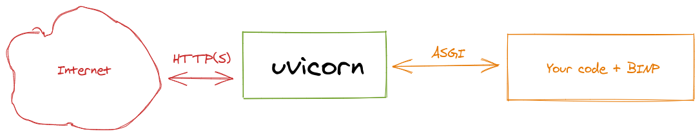
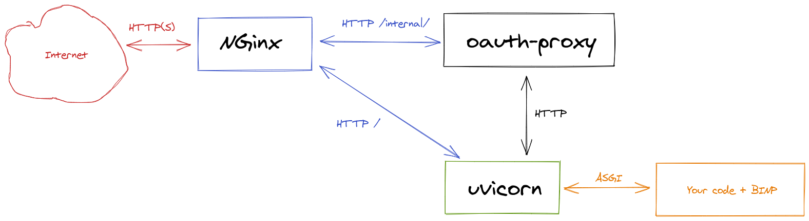

.. _configuration:

Configuration
=============

Quick and dirty
---------------

You should bind ``uvicron`` to external interface or to all interfaces by ``uvicron --host 0.0.0.0``

.. warning::

   Not recommended way:

   * anyone can reach your service without authorization
   * it's bad idea to put application server (uvicorn) outside: it's designed for computing, not for handling zillions requests.

In this scenario we exposed our application built on top of BINP directly to the outer world. Unsafe, but simple.

Better architecture
-------------------

* Nginx acts as reverse proxy
* Nginx can (and should in public networks) terminate SSL. Check how to setup `Let's encrypt`_  certificates with Nginx
* You can setup at least basic authorization

.. _Let's encrypt: https://www.nginx.com/blog/using-free-ssltls-certificates-from-lets-encrypt-with-nginx/

Examples
^^^^^^^^

Assuming that your BINP-based application started by ``uvicron`` at
localhost (127.0.0.1) and default port (8000).

On Debian-based OS, you may just copy-paste configuration to new file under ``/etc/nginx/sites-enabled.d/`` and restart
service after it.

Without authorization
"""""""""""""""""""""

Nginx configuration

.. code-block:: nginx

    server {
        listen 80;
        server_name default;

        location / {
            proxy_pass http://127.0.0.1:8000;
            proxy_http_version  1.1;
            proxy_cache_bypass  $http_upgrade;
            proxy_set_header Upgrade $http_upgrade;
            proxy_set_header Connection "upgrade";
        }
    }

With basic authorization
""""""""""""""""""""""""

Create users file by `instruction`_ (chapter "Creating a Password File" only).

.. _instruction: https://docs.nginx.com/nginx/admin-guide/security-controls/configuring-http-basic-authentication/

Nginx configuration

.. code-block:: nginx

    server {
        listen 80;
        server_name default;

        location / {
            proxy_pass http://127.0.0.1:8000;
            proxy_http_version  1.1;
            proxy_cache_bypass  $http_upgrade;
            proxy_set_header Upgrade $http_upgrade;
            proxy_set_header Connection "upgrade";
            auth_basic "Administrator’s Area";
            auth_basic_user_file /etc/apache2/.htpasswd;
        }
    }

It will secure everything.

To secure only internal API, but expose user-defined API:

.. code-block:: nginx

    server {
        listen 80;
        server_name default;

        location /internal/ {
            proxy_pass http://127.0.0.1:8000/internal/;
            proxy_http_version  1.1;
            proxy_cache_bypass  $http_upgrade;
            proxy_set_header Upgrade $http_upgrade;
            proxy_set_header Connection "upgrade";
            auth_basic "Administrator’s Area";
            auth_basic_user_file /etc/apache2/.htpasswd;
        }

        location / {
            proxy_pass http://127.0.0.1:8000;
            proxy_http_version  1.1;
            proxy_cache_bypass  $http_upgrade;
            proxy_set_header Upgrade $http_upgrade;
            proxy_set_header Connection "upgrade";
        }
    }

Best architecture
-----------------

* Uses OAuth2 to authorize internal API (and UI) by `oauth-proxy`_
* Allows user-defined apps be exposed without authorization (up to admin)

For example, I used `auth0`_ as identity provider.

Examples
^^^^^^^^

TBD - I am tired to write docs.

.. _oauth-proxy: https://oauth2-proxy.github.io/oauth2-proxy/
.. _auth0: https://auth0.com/

Administrating
--------------

Web server
^^^^^^^^^^

It's a ``uvicorn`` or other ASGI server responsibility, however,
most common flags for ``uvicron`` are:

* ``--host <host>`` - binding host, default 127.0.0.1
* ``--port <port>`` - binding port, default 8000

For example, using sample from main page, to expose service to all interfaces on port 8080:

.. warning::

   Do not do it on production - anyone can reach your service without authorization

.. code-block:: shell

    uvicorn --host 0.0.0.0 --port 8080 example:binp.app

* ``0.0.0.0`` - special host, means all IP, assigned to your machine

BINP internal configuration
^^^^^^^^^^^^^^^^^^^^^^^^^^^

By-default configuration done by environment variables.

Vars
""""

Default configuration can be changed by environment variables:

.. note::

   You can define vars in file and re-use it as: ``uvicron --env-file <filename>``

**DEV**

Boolean, disabled by default.

Enable development mode:

* Adds CORS rules
* Disables UI

Example: ``DEV=true uvicorn example:binp.app``

**DB_URL**

String, default ``sqlite:///data.db``

Sqlite URL of database location. In-memory database not supported.
Other than sqlite databases may be supported in a future.

Example: ``DB_URL=sqlite:///my.db uvicorn example:binp.app``

Customise
"""""""""

You may re-define absolutely each part of BINP instance by using
custom values during construction.

For example you want to store journals in other database:

.. code-block:: python

   from binp import BINP
   from binp.journals import Journals

   my_custom_db = None # define custom database and apply migrations

   binp = BINP(journal=Journals(my_custom_db))

   @binp.action
   @binp.journal
   async def hello():
       """
       Print hello world in console
       """
       print("hello world")

Backup and restore
^^^^^^^^^^^^^^^^^^

BINP-based application contains two part:

* Your code - I guess it stored somewhere in source control system like git.
* Runtime data

:Backup runtime data:

Just sqlite database. A single file that can be copied anytime anywhere. By-default, it will be created automatically
at first start in a working directory with name ``data.db``

:Restore:

Copy/replace saved database to the DB_URL location. By-default, in a working directory with name ``data.db``.

